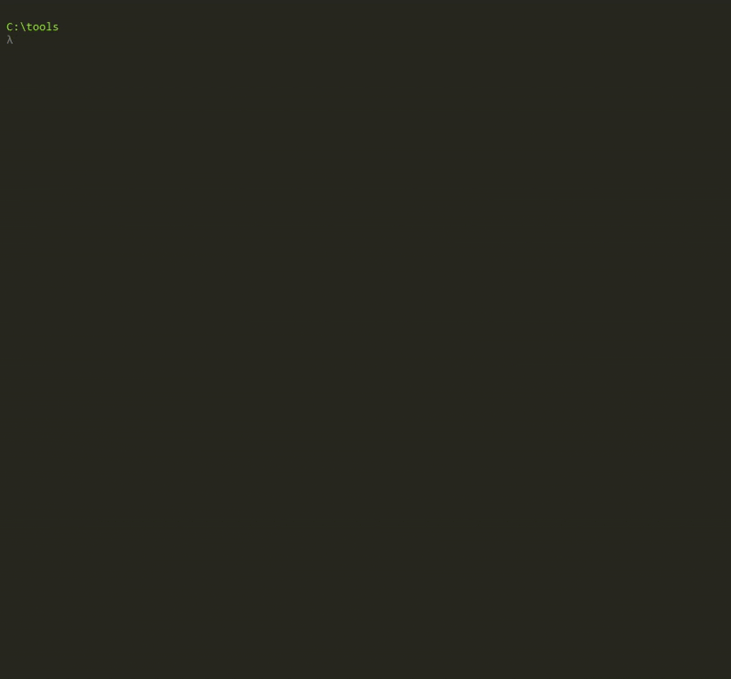

# Huge files generation and sorting

### Generator

This program generates a file of a specified size containing lines formatted as "number. string". The string portions can repeat (except in very small files), number portions may repeat too but less frequently.

The implementation uses the Bogus library, which provides ready-to-use datasets. Depending on the target file size, the program uses either product or company data (company data provider offers more combinations and variability, making it suitable for larger files). Since generating each line with Bogus is time-consuming, the program creates several data pools of appropriate size filled with Bogus data and combines random values from these pools to create lines. The line generation process is parallelized, with line producers sending batches to a single file writer (consumer) through a Channel.

### Sorter

This program sorts a specified file using an external merge sorting algorithm. String parts are compared first and if they are equal then numbers parts are compared. The process consists of two main steps:
1. The file is split into 10 MB chunks (this size was chosen empirically as the most optimal, larger chunks don't increase speed but lead to higher memory consumption, smaller chunks tend to affect speed). Each chunk is sorted in memory and saved to disk.
2. The chunks are then merged in several passes (two passes are generally sufficient for files less than hundreds of GB in size). During each pass, every 100 chunks are combined into one (this number was empirically chosen to avoid too many open files while maintaining optimal performance). The process continues until only one chunk remains, which becomes the final sorted result.  

### Demo

### Sorter Benchmarks

Sorter needs 2 times the input file size of additional disk space, one for all chunks and one for result file (at the last merging epoch result file is written before all chunks are removed).

| Input file size, GB | Peak memory consumption, MB | Execution time |
|---------------------|-----------------------------|----------------|
| 0.1                 | 220                         | 6s             |
| 1                   | 240                         | 50s            |
| 10                  | 230                         | 9m 30s         |

### Generator Benchmarks

| Target file size, GB| Peak memory consumption, MB | Execution time |
|---------------------|-----------------------------|----------------|
| 0.1                 | 24                          | 1s             |
| 1                   | 30                          | 8s             |
| 10                  | 60                          | 1m             |
